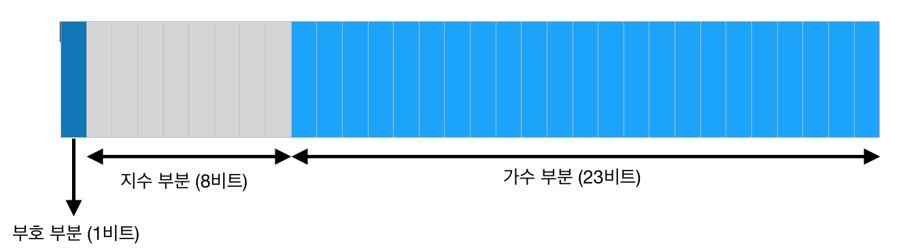

# 입출력과 변수

## printf로 다양한 데이터 출력하기

### 서식 지정자 ( Format Specifier)

- %[flag][width][.precision][size]type 의 형식으로 구성됨 | [ ] 속성은 필수가 아님
- [flag] : 출력된 값의 양쪽 맞춤을 정하고 기호, 공백, 선행하는 0, 소수점, 8진수 및 16진수 접두사의 출력을 제어하는 플래그 문자가 0개 이상인 플래그 지시문이 포함됨 *ex) -, +, 0, #...*
- [width] : 출력 문자의 최소 개수를 제어하는 음수가 아닌 10진수 정수. 출력 값의 문자 수가 지정된 너비보다 작으면, 최소 너비 값에 도달할 때까지 값의 왼쪽 또는 오른쪽에 공백이 추가됨
- [.precision] : 마침표(.) 뒤에 음수가 아닌 10진수 정수가 붙는 형식. 문자열 문자의 수, 소수점의 수 또는 출력할 유효 자릿수의 수를 지정함
- [size] : 크기 사양으로 형식의 변환 없이 출력할 자료형의 범위를 설정함
- type : 반드시 사용해야 하는 인수로 어떤 형식을 출력할 것인지 지정함.

    #include <stdio.h>
    
    int main(){
    	//%d : 정수 출력
    	printf("%d %d\n", 2, 3);
    	
    	//%f : 실수 출력, [.precision]으로 소수점 자릿수를 지정 가능(반올림)
    	printf("%f %f %.2f\n", 4.12, 5.1234567 ,5.1254);
    
    	//%g : 실수 출력 (지수 형태로도 출력)
    	printf("%g %.3g\n", 4.12, 5.1254);
    
    	//%c : 1바이트 문자 출력 (영어, 숫자, 몇몇 기호, \n : 1바이트 | 한글, 한자, 유니코드는 불가)
    	printf("%c %c\n", 'a', 'b');
    
    	//%s : 문자열 출력, 한글 등 가능
    	printf("%s", "좋습니다\n");
    	
    	return 0;
    }

    실행 결과
    
    2 3
    4.120000 5.123457 5.13
    4.12 5.125
    a b
    좋습니다

%f 는 [.precision]을 지정해 주지 않으면 6자리까지 기본으로 표시된다.

%g 는 뒤에 하나 이상의 수가 있는 경우에 표시되므로 [.precision]을 지정할 때 주의가 필요할 것이다. 

---

참조

[C언어 정리하기 - printf() 출력 형식](http://blog.naver.com/PostView.nhn?blogId=ruvendix&logNo=220891854070)

[형식 사양 구문: printf 및 wprintf 함수](https://docs.microsoft.com/ko-kr/cpp/c-runtime-library/format-specification-syntax-printf-and-wprintf-functions?view=vs-2019)

## 자료형

### 변수와 연산과 자료형

- 정수형
    - char : 1byte, 문자를 담는 데 쓰임
    - short : 2byte
    - long : 4byte
    - long long : 8byte
    - int : 시스템에 따라 자동 결정된다, 대체로 long 과 같다

    #include <stdio.h>
    
    int main(){
        //int : 4바이트, 정수를 담는 데 쓰임
        int i_a = 5, i_b = 3;
        
        int hap = i_a + i_b;
        int cha = i_a - i_b;
        int gop = i_a * i_b;
        int mok = i_a / i_b;
        int namuji = i_a % i_b;
        
        printf("%d + %d = %d\n", i_a, i_b, hap);
        printf("%d - %d = %d\n", i_a, i_b, cha);
        printf("%d * %d = %d\n", i_a, i_b, gop);
        printf("%d / %d = %d\n", i_a, i_b, mok);
        printf("%d %% %d = %d\n", i_a, i_b, namuji);
        
        return 0;
    }

    실행 결과
    
    5 + 3 = 8
    5 - 3 = 2
    5 * 3 = 15
    5 / 3 = 1
    5 % 3 = 2

- Integer Overflow, Integer Underflow (정수 오버플로우, 언더플로우)
    - 위의 자료형들의 크기와 같이, 정수형의 저장할 수 있는 값의 범위는 저장되어 있다. 이 때, 이 범위보다 크거나 작은 값을 저장하려 할 때 문제가 발생하는 것이 Integer Overflow, Integer Underflow이다.
    - int 형으로 받아온 수를 short 형 변수에 저장하는 등의 실수에서 자주 일어난다.
    - 변수에 수를 입력받아올 때, 범위 안의 수인지 검사하는 방식으로 예방할 수 있다.
- 실수형
    - float : 32bit (4byte), 실수를 담는 데 쓰임
    - double : 64bit (8byte), 실수를 담는 데 쓰임
        - 부동 소수점 (floating point)

        

        32비트 부동소수점수의 비트 구성 (IEEE 754)

        - 부호 부분 : 0일 때는 양수, 1일 때는 음수로 부호를 표현하는 비트
        - 지수 부분 : 수 크기의 기준이 되는 정보, 8bit 이므로 0 ~ 255인데 127을 빼어 -127 ~ 128로 사용한다. 단, 지수 부분이 0인 -127과 지수 부분이 255인 128은 다른 사용 용도가 있어 제외하고 사용한다.
        - 가수 부분 : 이 기준 값을 목표 값에 가깝게 하는 정보
        - 지수 부분의 계산 : 지수 부분의 값은 2의 지수에 들어가는 수를 결정한다. 따라서 지수 부분의 비트가 11100111(2)이면 231이므로 지수 부분을 계산하면 2^104가 된다.
        - 가수 부분의 계산 : 가수 부분의 비트는 위치에 따라 더하는 수가 결정된다. 가수 부분의 23비트 중, n번째 비트가 1이라면 지수 부분 결과 + 지수 부분 결과 / 2^n ... 을 계속 더해나가 소수를 만드는 것이다.

    #include <stdio.h>
    
    int main(){
        //float : 4바이트, 실수를 담는 데 쓰임
        float f_a = 9.8, f_b = 3.14;
        
        float hap = f_a + f_b;
        float cha = f_a - f_b;
        float gop = f_a * f_b;
        float mok = f_a / f_b;
        
        printf("%f + %f = %f\n", f_a, f_b, hap);
        printf("%f - %f = %f\n", f_a, f_b, cha);
        printf("%f * %f = %f\n", f_a, f_b, gop);
        printf("%f / %f = %f\n", f_a, f_b, mok);
        
        return 0;
    }

    실행 결과
    
    9.800000 + 3.140000 = 12.940001
    9.800000 - 3.140000 = 6.660000
    9.800000 * 3.140000 = 30.772001
    9.800000 / 3.140000 = 3.121019

- unsigned, signed : 자료형 부호 비트의 사용 여부를 결정짓는다. unsigned의 경우, 부호 비트를 수를 표현하는데 쓸 수 있으므로 signed 자료형에 비해 더 큰 수를 표현할 수 있다.
- void : 리턴값이 없는 함수의 자료형
- bool : 참, 거짓을 저장 (=char)

---

참조

[정수 오버플로우(Integer Overflow)](https://m.blog.naver.com/wwwkasa/80180210172)

[싸니까 믿으니까 인터파크도서](http://book.interpark.com/product/BookDisplay.do?_method=detail&sc.prdNo=263206069&gclid=Cj0KCQjwjoH0BRD6ARIsAEWO9DsVIjb1_D3eo3dhmbgYf5AaaCLHr-gY9HhrT3vwdvnPlvM9G2OaTOgaAjLtEALw_wcB)

## sizeof 연산자와 형변환

- sizeof(x) : x의 크기를 알려준다. 이때, x는 자료형 ( int, float, ... ) 또는 변수 이름

    #include <stdio.h>
    
    int main(){
        printf("%d %d %d %d\n", sizeof(int), sizeof(char), 
    			sizeof(float), sizeof(double));
        
        int i_a; char c_b; float f_c; double d_d;
        
        printf("%d %d %d %d\n", sizeof(i_a), sizeof(c_b), sizeof(f_c), sizeof(d_d));
        
        return 0;
    }

    실행 결과
    
    4 1 4 8
    4 1 4 8

    #include <stdio.h>
    
    int main(){
        int a = 3.14;
        double b = 10;
        
        printf("%d %f\n", a, b);
        
        return 0;
    }

    실행 결과
    
    3 10.000000

실수를 정수형 변수에 넣으면 정수 부분만이 저장된다.

정수를 실수형 변수에 넣으면 정수가 실수형으로 저장된다. 그러나 부동소수점 형식으로 저장되므로, 정수형 변수에 저장된 형식과는 다를 것이다. 

- 형변환 : 자료형을 다른 자료형으로 바꾸는 작업

    #include <stdio.h>
    
    int main(){
        int i_math = 90, i_korean = 95, i_english = 96;
        int i_sum = i_math + i_korean + i_english;
        
        double d_tmp = i_sum / 3;
        double d_avg = (double)i_sum / 3;
        
        printf("%f %f\n", d_tmp, d_avg);
        return 0;
    }
    
    // 정수 / 정수 = 정수
    // 실수 / 정수 = 실수
    // 실수 / 실수 = 실수
    
    // 정수 + 정수 = 정수
    // 정수 + 실수 = 실수

    실행 결과
    
    93.000000 93.666667

## 입력 받기

- scanf( ) : 변수에 값을 입력받을 때 쓰는 함수, printf( ) 와 사용방법이 거의 같다.

    #include <stdio.h>
    
    int main(){
        float f_a, f_b;
        
        scanf("%f %f", &f_a, &f_b);
        printf("%f %f\n", f_a, f_b);
        
        return 0;
    }

    입력
    
    3.14 9.8
    
    실행 결과
    
    3.140000 9.800000

scanf( )는 printf( )와 달리, 변수의 주소를 받아온다는 점을 유의해야 한다. 

## char 형과 ASCII 코드

- ASCII 코드 : 7비트로 구성된 부호체계로, 1바이트중 1비트는 통신 에러 검출을 위해 사용하기에 7비트만을 사용한다.

    #include <stdio.h>
    
    int main(){
        int i_a;
        
        printf("숫자 입력 : ");
        scanf("%d", &i_a);
        printf("%d의 ASCII 문자 : %c\n", i_a, i_a);
        
        return 0;
    }

    실행 결과
    
    숫자 입력 : 87
    87의 ASCII 문자 : W

int형의 정수더라도, ASCII 문자의 범위 안 숫자라면, 문자형으로 출력했을때 그에 대응하는 문자를 출력할 수 있다. 

## Section 1. 종합문제

- 두 숫자를 입력받아서 그 숫자들의 합을 출력하는 프로그램을 만들어 보세요.

    #include <stdio.h>
    
    int main(){
        float f_a, f_b;
        
        scanf("%f %f", &f_a, &f_b);
        printf("%f\n", f_a + f_b);
        
        return 0;
    }

    입력
    
    3.14 9.8
    
    실행 결과
    
    12.940001

- 체중 (kg, 실수) 과 키 (m, 실수) 를 입력받아서 체질량 지수를 구하는 프로그램을 만들어 보세요.

    #include <stdio.h>
    
    int main(){
        float f_weight, f_height;
        
        printf("체중(kg) 입력 : ");
        scanf("%f", &f_weight);
        printf("키(m) 입력 : ");
        scanf("%f", &f_height);
        
        float f_bmi = f_weight / (f_height * f_height);
        
        printf("BMI : %f\n", f_bmi);
        
        return 0;
    }

    체중(kg) 입력 : 55
    키(m) 입력 : 175
    BMI : 0.001796

- 알파벳을 입력받아서 그 다음 알파벳을 출력하는 프로그램을 만들어 보세요

    #include <stdio.h>
    
    int main(){
        char c_alpha;
        
        scanf("%c", &c_alpha);
        printf("%c\n", c_alpha + 1);
        
        return 0;
    }

    입력
    
    A
    
    실행 결과
    
    B